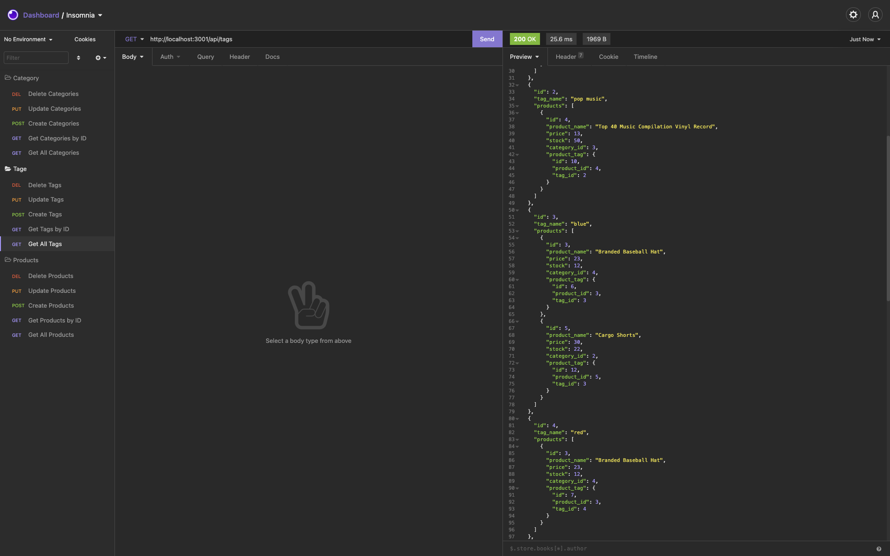
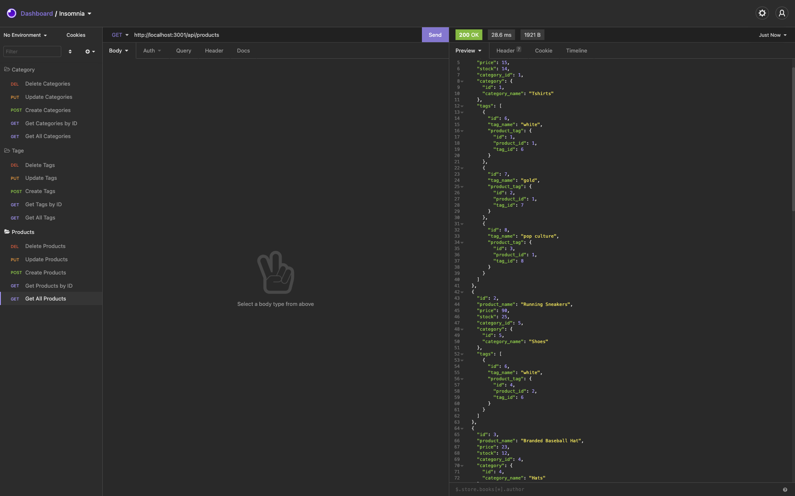

<div id="top"></div>

<!-- Badges -->
[](http://shields.io/)
[](http://shields.io/)
[](http://shields.io/)
[](http://shields.io/)
[](http://shields.io/)

# E-Commerce-Back-End
This app is the backend portion of an E-Commerce website. Express.js was used for the server and MySQL for the database along with Sequelize as the ORM to run SQL models and queries. The SQL database includes tables for products, categories, tags, and product tags. RESTful API routes are used to make requests and updates from the database which are joined through Sequelize queries.
## Table of Contents
<!-- TABLE OF CONTENTS -->
<details>
  <summary><strong>Table of Contents</strong></summary>
  <ol>
    <li>
      <a href="#about-the-project">About The Project</a>
      <ul>
        <li><a href="#built-with">Built With</a></li>
      </ul>
    </li>
    <li><a href="#user-story">User Story</a></li>
    <li><a href="#link-to-live-demo">Link to Live Demo</a></li>
    <li><a href="#usage">Usage</a></li>
    <li><a href="#prerequisites">Prerequisites</a></li>
    <li><a href="#installation">Installation</a></li>
    <li><a href="#contributing">Contributing</a></li>
    <li><a href="#license">License</a></li>
    <li><a href="#contact">Contact</a></li>
    <li><a href="#acknowledgments">Acknowledgments</a></li>
  </ol>
</details>

## About The Project
<p align="center">
  
&nbsp; &nbsp; &nbsp; &nbsp;
  
&nbsp; &nbsp; &nbsp; &nbsp;
  
</p>

Internet retail, also known as **e-commerce**, is the largest sector of the electronics industry, generating an estimated $29 trillion in 2019. E-commerce platforms like Shopify and WooCommerce provide a suite of services to businesses of all sizes. Due to their prevalence, understanding the fundamental architecture of these platforms will benefit you as a full-stack web developer.

## User Story

```md
AS A manager at an internet retail company
I WANT a back end for my e-commerce website that uses the latest technologies
SO THAT my company can compete with other e-commerce companies
```
### Link to Live Demo
[E-Commerce-Backend](https://drive.google.com/file/d/14VkoAjSs1qs_8mhaWnAIzUNo0RylE4M0/view)

### Prerequisites

Please make sure that you have the latest node packages.
* npm
  ```sh
  npm install npm@latest -g
  ```

## Installation 
- Download it through Github
- Run npm i or (npm install), to make sure to download all the necessary files in the jason package.

## Usage 
- Initiate the database with 'mysql -u root -p', then 'source db/schema.sql' to create the tables. 
- After installation Exit the mysql terminal and from bash or zsh, type `npm start` in the command line to start running the app.

### Built With

Node.js, Inquirer, and MySQL.
<p align="right">(<a href="#top">back to top</a>)</p>

## Contributing

Contributions are what make the open source community such an amazing place to learn, inspire, and create. Any contributions you make are **greatly appreciated**.

If you have a suggestion that would make this better, please fork the repo and create a pull request. You can also simply open an issue with the tag "enhancement".
Don't forget to give the project a star! Thanks again!

1. Fork the Project
2. Create your Feature Branch (`git checkout -b feature/AmazingFeature`)
3. Commit your Changes (`git commit -m 'Add some AmazingFeature'`)
4. Push to the Branch (`git push origin feature/AmazingFeature`)
5. Open a Pull Request


<!-- CONTACT -->
## Contact
[](http://shields.io/)

Mohamed Mesahel - mohamed.mesahel86@gmail.com

[](http://shields.io/)

https://github.com/MohamedMesahel

[![LinkedIn][linkedin-shield]][linkedin-url] 

<!-- LICENSE -->
## License

Distributed under the MIT License. 
<!-- ACKNOWLEDGMENTS -->
## Acknowledgments

List for some useful resources!
* [Node](https://node-app.com/)
* [MySQL](https://www.mysql.com/)


<p align="right">(<a href="#top">back to top</a>)</p>

<!-- MARKDOWN LINKS & IMAGES -->
<!-- https://www.markdownguide.org/basic-syntax/#reference-style-links -->
[linkedin-shield]: https://img.shields.io/badge/LinkedIn-0077B5?style=for-the-badge&logo=linkedin&logoColor=white
[linkedin-url]: https://www.linkedin.com/in/mohamed-mesahel-pmp-570a0423/


